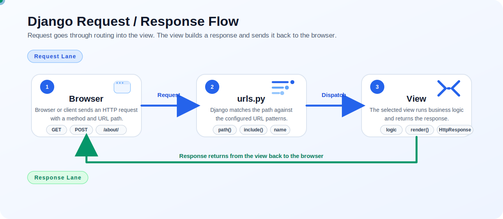

## Views

A Django view is the code that receives a request and returns a response.

In Django's `MVT` architecture, the URL dispatcher calls the view, and the view can work with both models and templates.

This folder is split into three short refreshers:

- [view.md](./view.md)
- [function_based_views.md](./function_based_views.md)
- [class_based_views.md](./class_based_views.md)

## Request flow



Blue shows the request path. Green shows the response path.

1. the browser sends an HTTP request
2. `urls.py` matches the route and dispatches the view
3. the view runs logic and builds the response
4. the response goes back to the browser

## Basic example

```py
from django.shortcuts import render

def home(request):
    return render(request, "index.html")
```

```py
from django.urls import path
from .views import home

urlpatterns = [
    path("", home, name="home"),
]
```

## Request data

The request reaches the view as an `HttpRequest` object.

Common patterns:

- use `request.method` to check `GET` or `POST`
- use `request.GET` to read query string values
- use `request.POST` to read submitted form data
- return `HttpResponse()` directly or `render()` for HTML

## Dynamic path

```py
from django.urls import path
from .views import course_detail

urlpatterns = [
    path("courses/<int:id>/", course_detail, name="course_detail"),
]
```

```py
from django.shortcuts import render

def course_detail(request, id):
    return render(request, "course_detail.html", {"id": id})
```

## Context

`context` is the dictionary you pass from the view to the template.

```py
def home(request):
    context = {"name": "Ahmad", "age": 22}
    return render(request, "index.html", context)
```

```html
<h1>{{ name }}</h1>
<p>{{ age }}</p>
```

## FBV vs CBV

| Type | Main idea       | Best for                      | URL usage                       |
| ---- | --------------- | ----------------------------- | ------------------------------- |
| FBV  | normal function | simple or custom logic        | `path("...", my_view)`          |
| CBV  | Python class    | reusable and structured logic | `path("...", MyView.as_view())` |

Django also provides generic class-based views such as `TemplateView`, `ListView`, `DetailView`, `CreateView`, and `UpdateView`.

## Rules to remember

- use `render(request, template, context)` when returning HTML
- use `HttpResponse()` for a direct text response
- use a function directly in `urls.py` for FBV
- use `.as_view()` in `urls.py` for CBV
- if the URL contains parameters, the view must accept them

## Quick choice

- choose `FBV` when you want clarity and simplicity
- choose `CBV` when you want reuse, inheritance, or generic views
