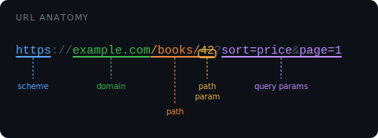
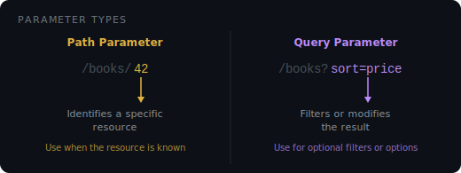

# URL

A **URL** (Uniform Resource Locator) is the address of a resource on the web. Every page, image, or API endpoint has one.



| Part         | Example              | Role                          |
| ------------ | -------------------- | ----------------------------- |
| scheme       | `https`              | Protocol used to communicate  |
| domain       | `example.com`        | Which server to talk to       |
| path         | `/books/42`          | Which resource on that server |
| query string | `?sort=price&page=1` | Optional filters or options   |

## Path Parameters

A path parameter is a **variable embedded inside the URL path**. It identifies a specific resource.

```
/books/42   ->  42 is the path parameter (a specific book)
```

In Django, you declare it in `urls.py` using angle brackets:

```python
# urls.py
from django.urls import path
from . import views

urlpatterns = [
    path("books/<int:id>/", views.get_book),
]
```

```python
# views.py
from django.http import HttpResponse

def get_book(request, id):
    return HttpResponse(f"Book ID: {id}")
```

Visit: `http://127.0.0.1:8000/books/42/` ->"Book ID: 42"

`<int:id>` tells Django to capture an integer from the URL and pass it to the view as `id`. You can also use `<str:name>`, `<slug:slug>`, etc.

## Query Parameters

Query parameters come **after `?`** in the URL. They are optional and used for filtering, sorting, or searching — not for identifying a specific resource.

```
/books?sort=price&page=2   ->  sort and page are query parameters
```

Django does **not** parse query params from `urls.py`. You read them inside the view from `request.GET`:

```python
# urls.py
urlpatterns = [
    path("books/", views.list_books),
]
```

```python
# views.py
def list_books(request):
    sort = request.GET.get("sort", "title")  # default: "title"
    page = request.GET.get("page", 1)
    return HttpResponse(f"Sorting by: {sort}, page {page}")
```

Visit: `http://127.0.0.1:8000/books/?sort=price&page=2` ->"Sorting by: price, page 2"

Use `.get("key", default)` instead of `["key"]` so the view does not crash when the param is missing.

## Path vs Query — When to use which



| Situation                  | Use         | Example             |
| -------------------------- | ----------- | ------------------- |
| Get one specific book      | Path param  | `/books/42`         |
| List books sorted by price | Query param | `/books?sort=price` |
| Get a user profile         | Path param  | `/users/99`         |
| Search for a keyword       | Query param | `/books?q=django`   |
| Page through results       | Query param | `/books?page=3`     |

**Rule:** if the value identifies _which_ resource, put it in the path. If it is an option or filter, put it in the query string.

## Body Parameters (POST)

Data sent in a POST request is not visible in the URL. It travels in the **request body** — used for forms and sensitive data.

```html
<!-- template -->
<form action="/submit/" method="POST">
	
	<input type="text" name="username" placeholder="Your name" />
	<input type="submit" value="Send" />
</form>
```

```python
# urls.py
urlpatterns = [
    path("submit/", views.handle_form),
]
```

```python
# views.py
def handle_form(request):
    if request.method == "POST":
        username = request.POST["username"]
        return HttpResponse(f"Hello, {username}")
```

> `` is required by Django on every POST form. It adds a hidden security token to protect against cross-site request forgery attacks.

## HTTP Status Codes

Every response Django sends back includes a status code telling the client what happened.

**Client errors (4xx)** — something wrong with the request:

| Code | Meaning                                 |
| ---- | --------------------------------------- |
| 400  | Bad Request — invalid data sent         |
| 401  | Unauthorized — login required           |
| 403  | Forbidden — logged in but no permission |
| 404  | Not Found — no resource at that URL     |

**Server errors (5xx)** — something failed on the server:

| Code | Meaning                                     |
| ---- | ------------------------------------------- |
| 500  | Internal Server Error — unhandled exception |

Django raises exceptions for these cases and routes them to error handler views. You can override them at the project level by setting `handler404`, `handler500`, etc. in your root `urls.py`.
