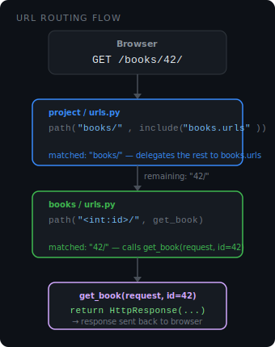

# URL Routing in Django

When a request hits Django, it needs to figure out which view to call. That job belongs to the **URL dispatcher** — the system that reads your `urlpatterns` lists and matches the incoming URL.

## How Django matches a URL

Django goes through `urlpatterns` top to bottom and stops at the **first match**. If nothing matches, it raises a 404.

```python
# urls.py
from django.urls import path
from . import views

urlpatterns = [
    path("",        views.home,   name="home"),
    path("about/",  views.about,  name="about"),
    path("books/",  views.books,  name="books"),
]
```

Request `GET /about/` -> skips `""`, matches `"about/"` -> calls `views.about`.

## `path()` — the building block

```python
path(route, view, name=None)
```

| Argument | What it is                                            |
| -------- | ----------------------------------------------------- |
| `route`  | The URL string to match (no leading slash)            |
| `view`   | The view function or class to call                    |
| `name`   | Optional name so you can reference this URL elsewhere |

```python
path("books/<int:id>/", views.get_book, name="book-detail")
#          ↑                  ↑                  ↑
#     URL pattern          view fn           name (optional)
```

### URL converters

Angle brackets capture a variable from the URL and pass it to the view:

| Converter     | Matches                                | Example                                |
| ------------- | -------------------------------------- | -------------------------------------- |
| `<int:id>`    | Whole numbers                          | `42`, `100`                            |
| `<str:name>`  | Any non-empty string (no slashes)      | `django`, `hello`                      |
| `<slug:slug>` | Letters, numbers, hyphens, underscores | `my-post-title`                        |
| `<uuid:uid>`  | UUID format                            | `550e8400-e29b-41d4-a716-446655440000` |

## `include()` — splitting URLs across apps

In a real project you don't put every URL in one file. Each app owns its own `urls.py`, and the project `urls.py` delegates to them using `include()`.



**Project `urls.py`** — top-level entry point:

```python
# mysite/urls.py
from django.contrib import admin
from django.urls import path, include

urlpatterns = [
    path("admin/",  admin.site.urls),
    path("books/",  include("books.urls")),   # delegate to books app
    path("users/",  include("users.urls")),   # delegate to users app
]
```

**App `urls.py`** — handles only its own routes:

```python
# books/urls.py
from django.urls import path
from . import views

urlpatterns = [
    path("",           views.list_books,  name="book-list"),
    path("<int:id>/",  views.get_book,    name="book-detail"),
]
```

**How the matching works:**

| Full URL     | Project matches | Passes to app | App matches                 |
| ------------ | --------------- | ------------- | --------------------------- |
| `/books/`    | `"books/"`      | `""`          | `""` -> `list_books`        |
| `/books/42/` | `"books/"`      | `"42/"`       | `"<int:id>/"` -> `get_book` |

- Django strips the matched prefix before passing the URL to the included file. So `books/urls.py` never sees `"books/"` it only sees what comes after.

## Named URLs and `reverse()`

Giving a URL a `name` lets you reference it by name instead of hardcoding the path string. This means if you rename a route, you only change it in one place.

```python
path("books/<int:id>/", views.get_book, name="book-detail")
```

**In a view** — use `reverse()` to build the URL programmatically:

```python
from django.urls import reverse
from django.http import HttpResponseRedirect

def some_view(request):
    url = reverse("book-detail", args=[42])  # -> "/books/42/"
    return HttpResponseRedirect(url)
```

**In a template** — use the `` tag:

```html
<a href="">View Book</a>
```

## URL namespaces

When multiple apps have views with the same name (e.g. both `books` and `users` have a `"list"` URL), names can clash. Namespaces fix this.

**In the project `urls.py`:**

```python
path("books/", include(("books.urls", "books"))),
#                                       namespace
```

**Referencing a namespaced URL:**

```python
reverse("books:list")     # in a view
    # in a template
```

The format is always `"namespace:name"`.

## Quick reference

```
browser request
     │
     ▼
project/urls.py   -> matches prefix -> include("app.urls")
     │
     ▼
app/urls.py       -> matches remainder -> calls view(request, ...)
     │
     ▼
view              -> returns HttpResponse / render(...)
```

| Function                   | Purpose                                  |
| -------------------------- | ---------------------------------------- |
| `path(route, view, name=)` | Define a URL pattern                     |
| `include("app.urls")`      | Delegate a URL prefix to another file    |
| `reverse("name", args=[])` | Build a URL from its name (in views)     |
| ``         | Build a URL from its name (in templates) |
