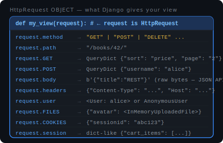

# HttpRequest and HttpResponse

When a browser sends a request to Django, two objects are at the center of everything:

- **`HttpRequest`** — Django builds this and hands it to your view. It contains everything about the incoming request.
- **`HttpResponse`** — you build this and return it from your view. It is what gets sent back to the browser.

## HttpRequest

Django creates an `HttpRequest` object for every incoming request and passes it as the first argument to your view (always named `request` by convention).



### Reading the request method

```python
def my_view(request):
    print(request.method)   # "GET", "POST", "PUT", "DELETE", ...
```

### Reading the URL

```python
request.path          # "/books/42/"  — just the path, no domain
request.get_full_path()  # "/books/42/?sort=price" — path + query string
```

### Reading query parameters (`GET`)

Query params come from the URL after `?`. They are always strings.

```python
# URL: /books/?sort=price&page=2

sort = request.GET.get("sort", "title")   # "price"  (default: "title")
page = request.GET.get("page", 1)         # "2"  (still a string!)
page = int(request.GET.get("page", 1))    # 2   (convert if you need a number)
```

Use `.get("key", default)` not `["key"]` — it won't crash if the param is missing.

### Reading form data (`POST`)

Form data sent via `method="POST"` lives in `request.POST`.

```python
# HTML form submitted with: username=ali, age=30

username = request.POST["username"]          # "ali"
username = request.POST.get("username", "")  # safer version
```

Both `request.GET` and `request.POST` are `QueryDict` objects — they behave like regular dicts but support multiple values for the same key.

### Reading the raw body (JSON APIs)

When a client sends JSON (not a form), it arrives as raw bytes in `request.body`. You have to parse it yourself.

```python
import json

def api_view(request):
    data = json.loads(request.body)   # parse bytes -> dict
    title = data["title"]
    ...
```

### Reading headers

```python
content_type = request.headers.get("Content-Type")
auth_header  = request.headers.get("Authorization")
```

Header names are case-insensitive: `"content-type"` and `"Content-Type"` both work.

### Reading the logged-in user

`request.user` is set by Django's authentication middleware.

```python
if request.user.is_authenticated:
    print(request.user.username)   # "ali"
else:
    print(request.user)            # AnonymousUser
```

### Reading uploaded files

Files uploaded via a form (`enctype="multipart/form-data"`) are in `request.FILES`.

```python
# <input type="file" name="avatar">

file = request.FILES["avatar"]
print(file.name)    # "photo.jpg"
print(file.size)    # 204800  (bytes)
file.read()         # raw bytes of the file
```

### Reading cookies and session

```python
# Cookies (sent by the browser automatically)
session_id = request.COOKIES.get("sessionid")

# Session (stored server-side, keyed by the session cookie)
cart = request.session.get("cart", [])
request.session["cart"] = cart + [item_id]   # write to session
```
