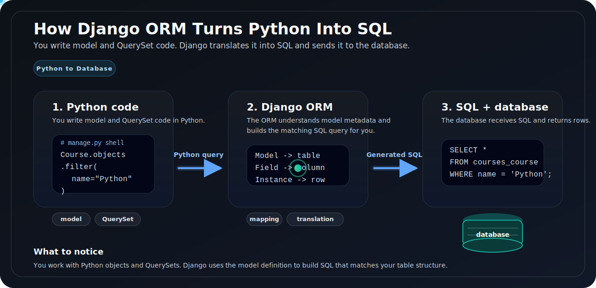

# ORM in Django

We store application data in a relational database, and relational databases speak SQL. In Django, we usually do not write SQL by hand for common tasks. We use the ORM instead.

**ORM** stands for **Object-Relational Mapping**. It maps Python code to database tables and SQL queries.

- The ORM does not remove SQL. It writes the SQL for you.



## Why use the ORM?

The ORM gives us a simpler way to work with data:

- define tables with Python classes
- insert and update rows with Python objects
- filter data with Python methods
- switch database backends with much less code change

For most app code, this is easier to read and maintain than writing raw SQL everywhere.

## How the mapping works

In Django, these pieces line up:

| Django         | Database         |
| -------------- | ---------------- |
| model class    | table            |
| model field    | column           |
| model instance | row              |
| `QuerySet`     | SQL query result |

## Defining a model

A model is a Python class that inherits from `models.Model`.

```python
# models.py
from django.db import models


class Course(models.Model):
    name = models.CharField(max_length=100)
    duration = models.CharField(max_length=50)
    price = models.PositiveIntegerField()

    def __str__(self):
        return self.name
```

After you create the model and run migrations, Django creates a matching table in the database.

- If you do not define a primary key, Django adds an `id` field automatically.

## From Python to SQL

The ORM lets us write Python code like this:

```python
# manage.py shell
from courses.models import Course

Course.objects.create(name="Python", duration="8 weeks", price=200)

python_courses = Course.objects.filter(name="Python")
```

The database still receives SQL. The ORM builds it for us. The `filter()` call above becomes SQL similar to this:

```sql
INSERT INTO courses_course (name, duration, price)
VALUES ('Python', '8 weeks', 200);

SELECT id, name, duration, price
FROM courses_course
WHERE name = 'Python';
```

The exact SQL can vary a little by database backend, but the idea is the same.

## What is a `QuerySet`?

A `QuerySet` is Django's representation of a database query.

```python
# manage.py shell
from courses.models import Course

courses = Course.objects.all()
```

`courses` is not a Python list. It is a `QuerySet`.

Important points:

- a `QuerySet` represents a query for one model
- Django evaluates it lazily, which means SQL is not sent immediately in many cases
- once evaluated, Django can cache its results inside that `QuerySet`

For example:

```python
# manage.py shell
courses = Course.objects.filter(price__gte=100)

for course in courses:
    print(course.name)
```

When the loop starts, Django sends the SQL query, gets the rows, and turns them into `Course` objects.

## How to see the generated SQL

When learning the ORM, it helps to inspect the SQL Django builds.

```python
# manage.py shell
queryset = Course.objects.filter(name="Python")
print(queryset.query)
```

That shows the SQL for the current queryset.

- Knowing basic SQL is still useful. The ORM makes database work smoother, but it does not replace database concepts like tables, indexes, joins, and constraints.

## Common ORM operations

### Create

```python
# manage.py shell
from courses.models import Course

course = Course(name="Django", duration="6 weeks", price=150)
course.save()
```

You can also create and save in one step:

```python
# manage.py shell
Course.objects.create(name="Django", duration="6 weeks", price=150)
```

### Read

```python
# manage.py shell
Course.objects.all()
Course.objects.get(id=1)
Course.objects.filter(price__lt=200)
```

### Update

```python
# manage.py shell
course = Course.objects.get(id=1)
course.price = 180
course.save()
```

### Delete

```python
# manage.py shell
course = Course.objects.get(id=1)
course.delete()
```

## ORM vs raw SQL

These two examples do the same job:

```python
# manage.py shell
Course.objects.filter(name="Python")
```

```sql
SELECT id, name, duration, price
FROM courses_course
WHERE name = 'Python';
```

Raw SQL gives you direct control. The ORM gives you cleaner application code for common database work.

## Quick reference

| Task           | ORM                               |
| -------------- | --------------------------------- |
| create one row | `Course.objects.create(...)`      |
| get all rows   | `Course.objects.all()`            |
| filter rows    | `Course.objects.filter(...)`      |
| get one row    | `Course.objects.get(...)`         |
| update one row | change fields, then call `save()` |
| delete one row | call `delete()`                   |
