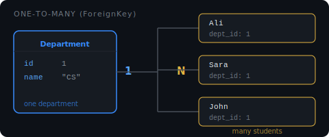

# One-to-Many (ForeignKey)

A **ForeignKey** creates a one-to-many relationship — one record in the parent table can be linked to many records in the child table.



**Real-world example:** one department has many students, but each student belongs to exactly one department.

## Defining it

The ForeignKey goes on the **child** model (the "many" side):

```python
# models.py
from django.db import models

class Department(models.Model):
    name = models.CharField(max_length=100)

    def __str__(self):
        return self.name

class Student(models.Model):
    name = models.CharField(max_length=100)
    department = models.ForeignKey(Department, on_delete=models.CASCADE)

    def __str__(self):
        return self.name
```

Django adds a `department_id` column to the `Student` table. That column stores the `id` of the related `Department`.

## Creating linked records

```python
# create the parent first
cs = Department.objects.create(name="Computer Science")

# create students linked to that department
Student.objects.create(name="Ali", department=cs)
Student.objects.create(name="Sara", department=cs)
```

## `on_delete` — what happens when the parent is deleted

This is **required** on every ForeignKey. It tells Django what to do with child records when the parent record is deleted.

**`CASCADE`** — delete all children too.

```python
department = models.ForeignKey(Department, on_delete=models.CASCADE)
# department is deleted → all its students are deleted
```

**`SET_NULL`** — set the foreign key to `NULL`. Requires `null=True` on the field.

```python
department = models.ForeignKey(Department, on_delete=models.SET_NULL, null=True)
# department is deleted → students stay, their department becomes NULL
```

**`SET_DEFAULT`** — set the foreign key to a default value. Requires `default=`.

```python
department = models.ForeignKey(Department, on_delete=models.SET_DEFAULT, default=1)
# department is deleted → students stay, their department becomes id=1
```

**`PROTECT`** — block the deletion entirely. Django raises an error if you try to delete a department that still has students.

```python
department = models.ForeignKey(Department, on_delete=models.PROTECT)
# cannot delete department while students reference it
```

| on_delete     | What happens to children | When to use                                    |
| ------------- | ------------------------ | ---------------------------------------------- |
| `CASCADE`     | Deleted with parent      | Comments on a deleted post                     |
| `SET_NULL`    | FK set to NULL           | Optional relationship                          |
| `SET_DEFAULT` | FK set to default value  | Fallback to a "default" parent                 |
| `PROTECT`     | Deletion blocked         | Parent should not be deleted if children exist |
