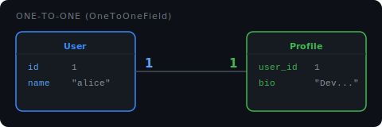

# One-to-One (OneToOneField)

A **OneToOneField** links one record to exactly one other record — no sharing, no duplicates.



**Real-world example:** each user has exactly one profile, and each profile belongs to exactly one user.

## Defining it

```python
# models.py
from django.db import models
from django.contrib.auth.models import User

class Profile(models.Model):
    user = models.OneToOneField(User, on_delete=models.CASCADE)
    bio  = models.TextField(blank=True)

    def __str__(self):
        return f"Profile of {self.user.username}"
```

Django adds a `user_id` column to the `Profile` table with a **unique constraint** — only one profile can point to each user.

## Creating linked records

```python
from django.contrib.auth.models import User

user = User.objects.create_user(username="ali", password="secret")
profile = Profile.objects.create(user=user, bio="Backend developer")
```

If you try to create a second profile for the same user, Django raises an `IntegrityError` — that's the one-to-one constraint enforcing itself.

## Accessing linked data

**Forward** — from Profile to User:

```python
profile = Profile.objects.get(id=1)
print(profile.user.username)   # "ali"
```

**Reverse** — from User to Profile:

```python
user = User.objects.get(username="ali")
print(user.profile.bio)   # "Backend developer"
```

- Django automatically creates the reverse accessor using the model name in lowercase (`profile`). No `_set` suffix — because there is only one, not many.

## `on_delete` works the same as ForeignKey

```python
user = models.OneToOneField(User, on_delete=models.CASCADE)
# user is deleted → profile is deleted too
```

All the same options apply: `CASCADE`, `SET_NULL`, `SET_DEFAULT`, `PROTECT`.

## OneToOneField vs ForeignKey

|                   | OneToOneField                     | ForeignKey                   |
| ----------------- | --------------------------------- | ---------------------------- |
| Relationship      | 1 → 1                             | 1 → many                     |
| Unique constraint | Yes (built-in)                    | No                           |
| Reverse accessor  | `user.profile`                    | `department.student_set`     |
| Use when          | Extending a model with extra data | Multiple children per parent |
