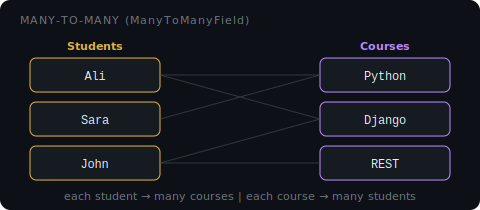

# Many-to-Many (ManyToManyField)

A **ManyToManyField** lets both sides have multiple connections — each record on one side can link to many records on the other side, and vice versa.



**Real-world example:** students can enroll in many courses, and each course can have many students.

## Defining it

Put the `ManyToManyField` on either model — Django handles the rest:

```python
# models.py
from django.db import models

class Course(models.Model):
    name = models.CharField(max_length=100)

    def __str__(self):
        return self.name

class Student(models.Model):
    name    = models.CharField(max_length=100)
    courses = models.ManyToManyField(Course, related_name="students")

    def __str__(self):
        return self.name
```

- You cannot set `on_delete` or `default` on a ManyToManyField — it does not add a column to either table. Instead, Django creates a **junction table** `(join table)` behind the scenes.

## The junction table

Django automatically creates a third table that holds pairs of IDs. The table name follows this pattern:

```
<app_label>_<model_lowercase>_<field_name>
```

So for a `courses` app with model `Student` and field `courses`, the table is named `courses_student_courses`.

| Part      | Value      | Comes from                          |
| --------- | ---------- | ----------------------------------- |
| `courses` | app label  | The app the model belongs to        |
| `student` | model name | Model class name (lowercased)       |
| `courses` | field name | The ManyToManyField name on Student |

This table holds pairs of IDs:

| student_id | course_id  |
| ---------- | ---------- |
| 1 (Ali)    | 1 (Python) |
| 1 (Ali)    | 2 (Django) |
| 2 (Sara)   | 1 (Python) |
| 3 (John)   | 2 (Django) |
| 3 (John)   | 3 (REST)   |

You never touch this table directly — Django manages it through `.add()`, `.remove()`, and `.clear()`.

### Inspecting the junction table

If you want to see the raw data in the join table, you can access it via the `through` model:

```python
# see all rows in the junction table
Student.courses.through.objects.all().values()
# <QuerySet [{'id': 1, 'student_id': 1, 'course_id': 1}, ...]>
```

- `through` is the auto-generated model Django creates for the junction table. You don't need raw SQL — this gives you full ORM access to it.

## Creating and linking records

First create the records, then link them with `.add()`:

```python
# create courses
python_course = Course.objects.create(name="Python")
django_course = Course.objects.create(name="Django")
rest_course   = Course.objects.create(name="REST")

# create a student
ali = Student.objects.create(name="Ali")

# link student to courses
ali.courses.add(python_course, django_course)
```

- You must `save()` or `create()` both objects before using `.add()` — you cannot link unsaved records.

## Querying linked records

**Forward** — from Student to their Courses:

```python
ali = Student.objects.get(name="Ali")
ali.courses.all()
# <QuerySet [<Course: Python>, <Course: Django>]>
```

**Reverse** — from Course to its Students (uses `related_name`):

```python
python = Course.objects.get(name="Python")
python.students.all()
# <QuerySet [<Student: Ali>, <Student: Sara>]>
```

## Managing links

**`.add()`** — link records:

```python
ali.courses.add(rest_course)
```

**`.remove()`** — unlink records (does not delete the course, just removes the connection):

```python
ali.courses.remove(rest_course)
```

**`.clear()`** — remove all links:

```python
ali.courses.clear()   # ali now has no courses
```

**`.set()`** — replace all links at once:

```python
ali.courses.set([python_course, rest_course])
# ali now has Python and REST only
```

## Quick reference

| Action                | Code                                      |
| --------------------- | ----------------------------------------- |
| Link                  | `student.courses.add(course1, course2)`   |
| Unlink                | `student.courses.remove(course1)`         |
| Replace all           | `student.courses.set([course1, course2])` |
| Clear all             | `student.courses.clear()`                 |
| Get related (forward) | `student.courses.all()`                   |
| Get related (reverse) | `course.students.all()`                   |
